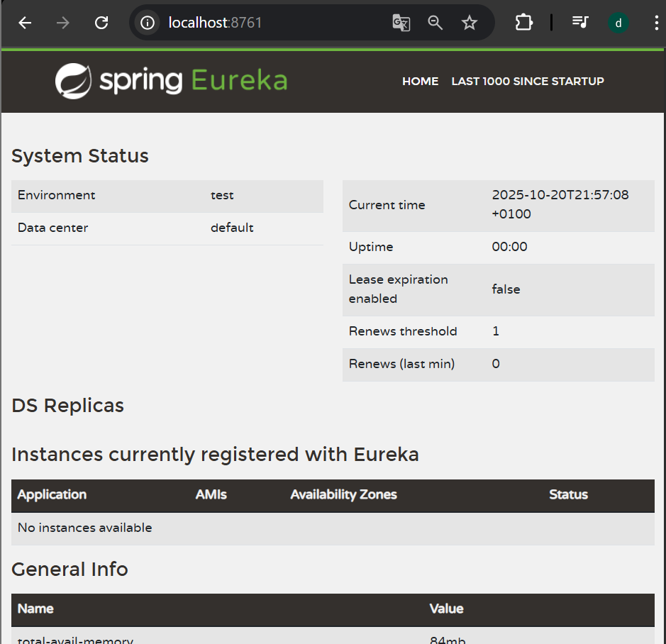
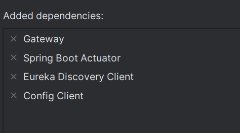
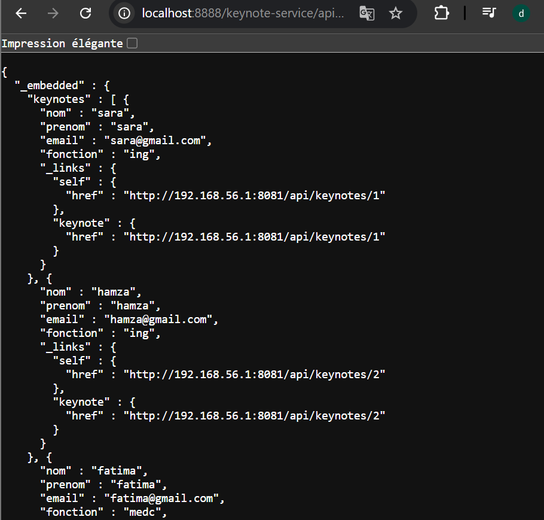
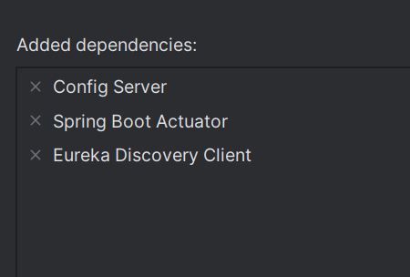
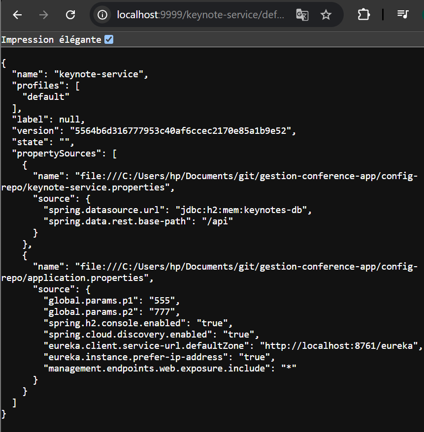
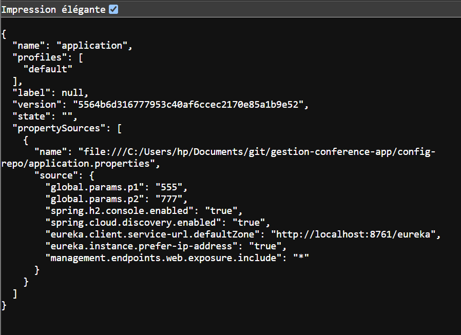

# 🧭 Microservices Configuration Guide

Ce projet met en place une architecture **Spring Cloud** basée sur les **microservices**, comprenant les modules suivants :

- 🧩 **Discovery Service (Eureka Server)**
- 🚪 **Gateway Service**
- ⚙️ **Config Service (Spring Cloud Config Server)**
- 🎤 **Keynote Service**
- 🏛️ **Conference Service**

---

## 🧩 1. Discovery Service (Eureka Server)

### 📦 Dépendances

Ajoutez la dépendance suivante dans le fichier **`pom.xml`** :

```xml
<dependencies>
    <dependency>
        <groupId>org.springframework.cloud</groupId>
        <artifactId>spring-cloud-starter-netflix-eureka-server</artifactId>
    </dependency>
</dependencies>
```

---

### 🧠 Classe principale (`DiscoveryServiceApplication.java`)

```java
package com.example.discoveryservice;

import org.springframework.boot.SpringApplication;
import org.springframework.boot.autoconfigure.SpringBootApplication;
import org.springframework.cloud.netflix.eureka.server.EnableEurekaServer;

@SpringBootApplication
@EnableEurekaServer
public class DiscoveryServiceApplication {
    public static void main(String[] args) {
        SpringApplication.run(DiscoveryServiceApplication.class, args);
    }
}
```

---

### ⚙️ Configuration (`application.properties`)

```properties
spring.application.name=discovery-service
server.port=8761

# Désactivation de l'enregistrement du serveur lui-même dans Eureka
eureka.client.fetch-registry=false
eureka.client.register-with-eureka=false
```

📸 **Interface Eureka :**


---

## 🚪 2. Gateway Service

Le **gateway-service** permet de router les requêtes vers les microservices de manière **dynamique** à partir du registre **Eureka**.

---

### 📦 Dépendances (`pom.xml`)

Ajoutez les dépendances suivantes :

```xml
<dependencies>
    <dependency>
        <groupId>org.springframework.cloud</groupId>
        <artifactId>spring-cloud-starter-gateway</artifactId>
    </dependency>

    <dependency>
        <groupId>org.springframework.cloud</groupId>
        <artifactId>spring-cloud-starter-netflix-eureka-client</artifactId>
    </dependency>
</dependencies>
```

📸 **Illustration des dépendances :**


---

### 🧠 Classe principale (`GatewayServiceApplication.java`)

```java
package com.example.gatewayservice;

import org.springframework.boot.SpringApplication;
import org.springframework.boot.autoconfigure.SpringBootApplication;
import org.springframework.cloud.client.discovery.ReactiveDiscoveryClient;
import org.springframework.cloud.gateway.discovery.DiscoveryClientRouteDefinitionLocator;
import org.springframework.cloud.gateway.discovery.DiscoveryLocatorProperties;
import org.springframework.context.annotation.Bean;

@SpringBootApplication
public class GatewayServiceApplication {

    public static void main(String[] args) {
        SpringApplication.run(GatewayServiceApplication.class, args);
    }

    @Bean
    public DiscoveryClientRouteDefinitionLocator discoveryClientRouteDefinitionLocator(
            ReactiveDiscoveryClient reactiveDiscoveryClient,
            DiscoveryLocatorProperties discoveryLocatorProperties) {
        return new DiscoveryClientRouteDefinitionLocator(reactiveDiscoveryClient, discoveryLocatorProperties);
    }
}
```

---

### ⚙️ Configuration (`application.properties`)

```properties
spring.application.name=gateway-service
server.port=8888

spring.cloud.gateway.discovery.locator.enabled=true
spring.cloud.gateway.discovery.locator.lower-case-service-id=true

eureka.client.service-url.defaultZone=http://localhost:8761/eureka/
```
alore on a un systeme de routage dynamique
http://localhost:8888/keynote-service/api/keynotes


---

## ⚙️ 3. Config Service (Spring Cloud Config Server)

Le **config-service** fournit la configuration centralisée pour tous les microservices.

---

### 📦 Dépendances (`pom.xml`)

Ajoutez les dépendances nécessaires :

```xml
<dependencies>
    <dependency>
        <groupId>org.springframework.cloud</groupId>
        <artifactId>spring-cloud-config-server</artifactId>
    </dependency>
</dependencies>
```

📸 **Illustration des dépendances :**


---

### 🧠 Classe principale (`ConfigServiceApplication.java`)

```java
package com.example.configservice;

import org.springframework.boot.SpringApplication;
import org.springframework.boot.autoconfigure.SpringBootApplication;
import org.springframework.cloud.config.server.EnableConfigServer;

@SpringBootApplication
@EnableConfigServer
public class ConfigServiceApplication {
    public static void main(String[] args) {
        SpringApplication.run(ConfigServiceApplication.class, args);
    }
}
```

---

### ⚙️ Configuration (`application.properties`)

```properties
spring.application.name=config-service
server.port=9999

# Dépôt Git local contenant les fichiers de configuration
spring.cloud.config.server.git.uri=file:///C:/Users/hp/Documents/git/gestion-conference-app/config-repo
```
# test 
http://localhost:9999/keynote-service/default

http://localhost:9999/application/default

---

