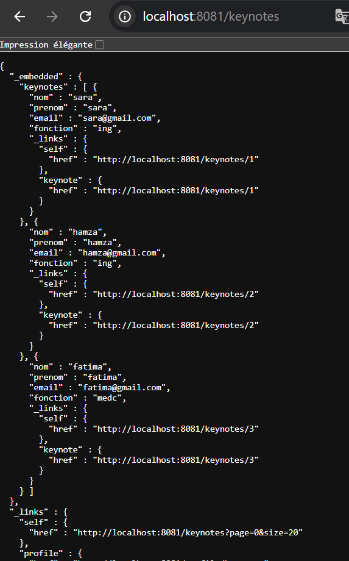

discovery-service
<dependencies>
<dependency>
<groupId>org.springframework.cloud</groupId>
<artifactId>spring-cloud-starter-netflix-eureka-server</artifactId>
</dependency>
</dependencies>

ajouter cette annotation dans DiscoveryServiceApplication.java
@EnableEurekaServer

ajouter dans fichier application.propriete
spring.application.name=discovery-service
server.port=8761
eureka.client.fetch-registry=false
eureka.client.register-with-eureka=false

gatwaey-service
configuration de gateway de manier dynamique 
ajouter ces dependence 

	@Bean
	DiscoveryClientRouteDefinitionLocator discoveryClientRouteDefinitionLocator
			(ReactiveDiscoveryClient reactiveDiscoveryClient, DiscoveryLocatorProperties discoveryLocatorProperties) {
		return new DiscoveryClientRouteDefinitionLocator(reactiveDiscoveryClient, discoveryLocatorProperties);
	}

